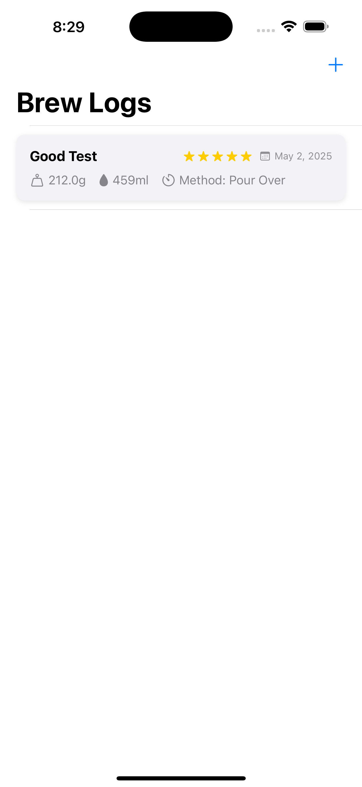
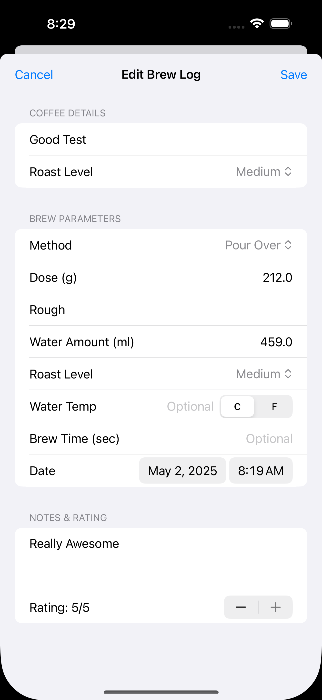
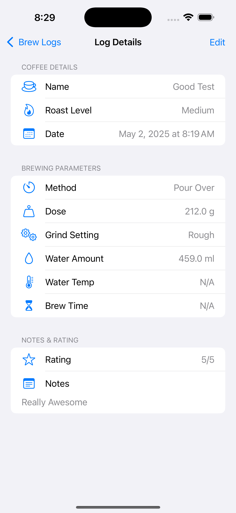

# MCoffee - Brew Log App

MCoffee is an iOS application for logging coffee brewing details. It allows users to track parameters like coffee name, dose, water amount, brew time, grind setting, method, and more.

## Technologies Used

*   **iOS Frontend:** SwiftUI
*   **Log Persistence:** `UserDefaults` (within the iOS app)
*   **iOS Project Generation:** XcodeGen
*   **iOS Dependency Management:** CocoaPods

## Build & Run Instructions

1.  **Generate Xcode Project:**
    ```bash
    xcodegen generate
    ```
2.  **Install Pods:**
    ```bash
    pod install --repo-update
    ```
    *(Note: You might need `arch -x86_64 pod install --repo-update` on Apple Silicon Macs if you encounter pod install issues).*
3.  **Open & Run:** Open `MCoffee.xcworkspace` in Xcode and build/run the `MCoffee` scheme.

## Notes

*   Ensure you have XcodeGen and CocoaPods installed.
*   The project requires Xcode and the iOS SDK.

## Screenshots


*Log List View*


*Add/Edit Log View*


*Log Detail View*
